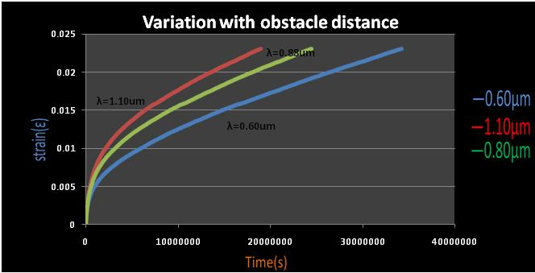
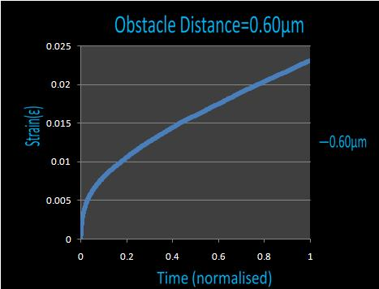
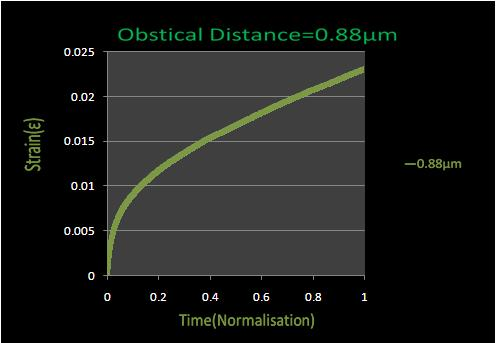
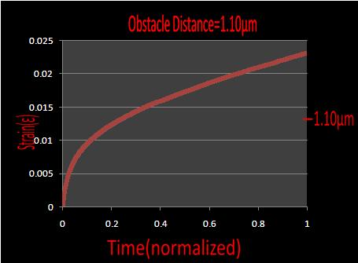
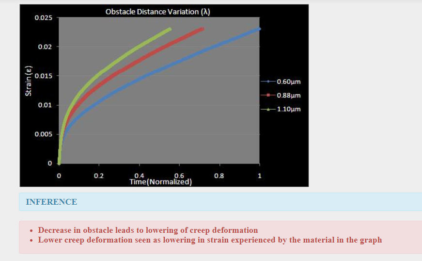

Creep is progressive i.e. permanent and time dependant deformation of a material at a constant stress below the yield strength of the material. Creep is seen in all types of materials and is observed to be severe in materials that are utilized in applications involving high operating temperatures for long periods of time. The deformation caused by creep need not always be catastrophic i.e. if a component is deformed by creep beyond the tolerable limits of the application, the application as a whole may fail even though the component has not actually fractured. Also it is not always an undesirable property, e.g. concrete has inbuilt tensile stresses which may lead to its fracture however, due to some moderate creep these stresses get relieved and the structure is saved. It is important to note that the words "permanent" and "time dependant" are very important since the deformation is not an elastic one nor is it a brittle one.The strain keeps on building over a period of time. Creep though dependant on various factors is generally observed to increase with rise in temperature.It is particularly important for metals whose operating temperature is greater than 0.4Tm and even amorphous polymers are sensitive to creep   
<video width="320" height="240" controls>
  <source src="images/cmf.mp4" type="video/mp4">
  Your browser does not support the video tag.
</video> 
Obstacle is something which blocks your path. Roadblocks etc. could serve as artificial obstacles while a mental block is a good example of a non physical obstacle which is a more potent force than any of the obstacles mentioned above. However, when we are dealing with dislocations we are operating at a micron scale and obstacles to dislocation motion could be precipitates, grain boundaries or other dislocations as well. Obstacle need not be some physical object blocking the path it could be a force generated due to some reaction at some totally different location. Just as we go around, over or through an obstacle, dislocations might as well take one of these paths to overcome the obstacles. The obstacle size, distribution, etc. effect the energy required to overcome the obstacle. A decrease in obstacle distance leads to an increase in the number of obstacles encountered by dislocations during their motion and since energy is required to overcome an obstacle higher the number of obstacles more is the energy required to overcome these obstacles. This leads to lowering of creep deformation since a major portion of the deformation energy is consumed in overcoming of the obstacles. 
 
Schematic diagram showing effect of obstacle distance on the creep deformation of a material  
<b>Results</b> 
Following are the creep transient results for some of the obstacle distances which have been tested: 
 
0.60&micro;m  
 
0.88&micro;m  
 
1.10&micro;m  
<b>Conclusions</b>  
 
